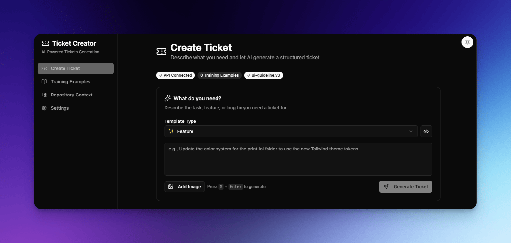

# Ticket Creator

[](https://opensource.org/licenses/MIT)

AI-powered ticket generator for development teams. Transform natural language descriptions into well-structured, context-aware tickets using OpenAI's latest models.



## 🚀 Quick Start

### Prerequisites
- **Node.js** 24.x (LTS) or higher
- **pnpm** 10.x or higher
- **OpenAI API key** ([Get one here](https://platform.openai.com/api-keys))

### Installation & Run

```bash
# Clone the repository
git clone https://github.com/Zyruks/ticket-creator
cd ticket-creator

# Install dependencies
pnpm install

# Start development server
pnpm dev
```

The app will open at `http://localhost:5173`.

## 📖 Usage

1. **Setup**: Go to Settings (⚙️) and enter your OpenAI API Key.
2. **Create**: Click Ticket (🎫), select a template, and describe your task.
3. **Features**:
   - **AI Generation**: Creates structured tickets from descriptions.
   - **Context**: Import repository structure for better results.
   - **Templates**: Custom styles and few-shot learning examples.

## 📄 License

This project is licensed under the MIT License - see the [LICENSE](LICENSE) file for details.

## 🙏 Acknowledgments
- [shadcn/ui](https://ui.shadcn.com/)
- [Radix UI](https://www.radix-ui.com/)
- [Biome](https://biomejs.dev/)
- [OpenAI](https://openai.com/)
